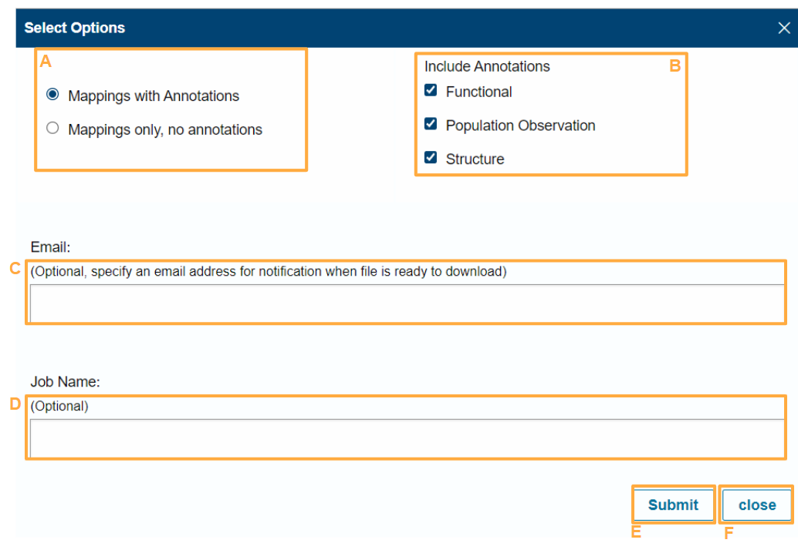

### Help

1. [Website](#website)
2. [Download File](#download-file)
3. [API](#api)
4. [Direct Variant Link](#direct-variant-link)

---

##### Website

Clicking each category in the contents below will take you to an annotated image of the relevant page in ProtVar linked to more detailed descriptions of each feature.

- [Home Page](#home-page)
- [Results Page](#results-page)
- [Function Annotations](#function-annotations)
- [Population Observations](#population-observations)
- [Structure Annotations](#structure-annotations)
- [Download Options](#download-options)
- [My Downloads](#my-downloads)

###### Home Page

**A.** ProtVar retrieves annotations and predictions for human [missense](#missense) variants.  
**B.** The [results page](#results-page) page following variant list submission.  
**C.** [My downloads](#my-downloads) contains all the files you have submitted for download. These can be downloaded from here to your local computer.  
**D.** This can be used to [contact](#contact) ProtVar with questions, comments or suggestions.  
**E.** About contains information about the ProtVar resource. HELP contains information to help users use the ProtVar resource.  
**F.** Variants can be pasted in the box and then submitted to ProtVar by clicking “Search”. Several [data types](#data-types) and formats can be submitted. ProtVar maps [genomic coordinates to protein positions](#genomic-coordinates-to-protein-positions) and [protein positions to genomic coordinates](#protein-position-to-genomic-coordinates)  
**G.** Users can choose which [genome assembly](#genome-assembly) to use for mapping or leave it for ProtVar to decide.  
**H.** [File upload](#file-upload) can be used for uploading large files from your computer.  
**I.** [ProtVar REST API](#protvar-rest-api) can be used to obtain data programmatically.  

###### Results Page

**A.** Return to [home page](#home-page) where new variants can be submitted.  
**B.** The results page, showing the results of variant submission.  
**C.** [My downloads](#my-downloads) contains all the files you have submitted for download. These can be downloaded from here to your local computer. Users can return to the same results again by clicking the 'Results' tab.    
**D.** This can be used to [contact](#contact) ProtVar with questions, comments or suggestions.  
**E.** About contains information about the ProtVar resource. HELP contains information to help users use the ProtVar resource.  
**F.** Navigate to the previous or next page of results.  
**G.** Choose how many results to display on the page.  
**H.** Download all variant results. The file will be available in [My downloads](#my-downloads)  
**I.** The data is split into [genomic position](#genomic-position) and [protein position](#protein-position) and [annotations](#annotations)  
**J.** The [data type](#data-types) used to submit the variant is shown in pink. Multiple lines may be shown for a single input in cases such as overlapping genes or when the specific SNP is ambiguous.  
**K.** [CADD](#cadd) score is a nucleotide level predictor of pathogenicity.  
**L.** Mappings to different [isoforms](#isoforms) can be observed by expanding.  
**M.** [EVE](#eve) is an amino acid level predictor of pathogenicity.  
**N.** Each of three Annotation types [Function annotation](#function-annotations) and [Population Observations](#population-observations) and [Structure Annotations](#structure-annotations) regarding each variant can be explored by clicking on the icons.

###### Function Annotations

  
**A** - This page contains the [function annotations](#function-annotations) relating to the variant position in the protein.  
**B** - This window contains data regarding the precise variant position in the protein from UniProt and predictions.  
**C** - [The predicted free energy change](#predicted-free-energy-change) in the protein when the reference amino acid is replaced with the variant.  
**D** - Information regarding the [region](#region) in which the variant position is located from UniProt.  
**E** - Predicted [protein pockets](#protein-pockets) and [protein-protein interfaces](#protein-protein-interfaces) containing the variant position.  
**F** - A description of the function of the protein from UniProt.  
**G** - This window contains information about the reference protein from UniProt.  
**H** - Protein names and identifiers and UniProt entry information.  
**I** - [General protein information](#general-protein-information) from UniProt.  
**J** - [Ensembl identifiers](#ensembl-identifiers) for the gene and for the transcript which translates to the UniProt canonical isoform.

###### Population Observations

  
**A** - This page contains data about the variant in other resources and [co-located variants](#co-located-variants)  
**B** - This window displays identifiers of the user submitted variant in different databases with links to them.  
**C** - Variants [co-located](#co-located-variants) at the same amino acid as the user variant and associated diseases.  
**D** - Diseases associated with variation in the protein.

###### Structure Annotations

  
**A** - This page shows the position of the user variant in protein structures.  
**B** - The [3D structure viewer](#3d-structure-viewer) displays the structures selected from the tables on the right.  
**C** - The structure can be animated via this button for example it can spin or rock.  
**D** - Reset the camera to see the whole protein.  
**E** - Take a screenshot of the current view.  
**F** - Control panel options to change how the structure looks.  
**G** - Expand the view to fill the screen.  
**H** - Change the settings.  
**I** - Selection mode for residues or regions.  
**J** - All experimental structures which contain the variant position are shown in this table.  
**K** - The latest AlphaFold model for the protein containing the variant. Predicted pockets are also displayed in this table if they contain the variant position.  
**L** - Predicted [protein-protein interactions](#protein-protein-interfaces) are displayed in this table if the variant is considered to be part of the interface.

###### Download Options

  
**A** - Users can choose to obtain mappings with annotations or mappings only (which is much faster).  
**B** - Users can choose which specific fields are most useful to them.  
**C** - Email addresses are optional and are used to notify users when their job is ready.  
**D** - Job names are optional but can help users to identify specific jobs when multiple jobs have been submitted.  
**E** - Pressing submit will put the job in a queue. The results will be available from the [My Downloads](#my-downloads) tab.  
**F** - Close to return to the results page

###### My Downloads

  
**A** - All of the users downloads for this session will be displayed in this page.  
**B** - The number of downloads for this session.  
**C** - A date and time stamp when the download request was received.  
**D** - ProtVar generated ID.  
**E** - User supplied job name.  
**F** - Status - an email will be sent to the user when the requested data is ready to download if they have chosen to supply one. The page will need to be refreshed manually to see the updated status.    
**G** - Button to download to the user’s local machine.  
**H** - Delete the file from the list.

#### Website Help Further Information

**3D Structure Viewer:** 3D structures are visualised using the Mol* viewer which “is a modern web-based open-source toolkit for visualisation and analysis of large-scale molecular data”. Further information can be found at their website: [Mol* website](https://molstar.org/)
ProtVar uses a limited version of Mol* with less functionality than the full version to allow proteins to be displayed quickly and smoothly.  

**Annotations:** Annotations are subdivided into function annotations, population observations and structure annotations. Annotations either help the user to understand the function of the reference amino acid at the variant position, evaluate the likelihood that the variant amino acid will alter the function or contextualise the variant position and protein role to suggest what effect the variant may have on the organism.

**CADD:** CADD scores “the deleteriousness of single nucleotide variants as well as insertion/deletions variants in the human genome” - from the [CADD website](https://cadd.gs.washington.edu/) CADD scores are freely available for all non-commercial applications however a licence is required for commercial applications, details of which can be found on their website. [CADD citation](https://www.nature.com/articles/ng.2892)

**Co-located Variants:** ProtVar retrieves variants which have been reported at the same amino acid position as the variant. This mean that the point mutation itself may be any of the three nucleotide position of the codon, not necessarily the same genomic position as the user entered variant.

**Contact:** If you have any problems using ProtVar or cannot retrieve the data you want then please use the contact form to get in touch with the ProtVar team who will do their best to assist you. Additionally if you have any suggestions to improve ProtVar or requests to add something new to help your work then please let us know.

**Data Types:** The following variant input data types are currently supported by ProtVar: [VCF](#vcf), [gnomAD](#gnomad), [HGVS](#HGVS), [Protein position](#protein-position), [dbSNP ID](#dbsnp-id).  

Examples of each of the formats can be found to the right of the paste input box.
A mixture of formats can be submitted. For example:    
>rs864622779  
P22304 A205P  
X 149498202 . C G  

ProtVar will evaluate each one and map them to the protein position in a unified format.

**dbSNP ID:** dbSNP is a resource which “contains human single nucleotide variations, microsatellites, and small-scale insertions and deletions." The resource can be found here: [dbSNP website](https://www.ncbi.nlm.nih.gov/snp/) Variants in ProtVar can be searched via the paste box or uploaded using dbSNP RefSNP IDs for example:  
> rs4148323.  

Because dbSNP IDs may represent more than one variant allele, ProtVar will separate the different variant alleles onto different lines on the mapping page. This is because the different variant alleles may have different consequences to the protein

**Download:** Downloads can be tailored according to the users’ needs. If only mappings from genomic coordinates to protein positions are required then “mappings only” can be used. If specific annotations are required then these can be selected individually. Each annotation category selected adds extra time to produce the downloadable file. Files ready for download are displayed in the "My Downloads” section. Optionally users can add a job name to keep track of multiple jobs and an email address so that they can be informed when the file is ready to be downloaded. All of the annotations in the download file can also be accessed programmatically via the ProtVar REST API.

**Ensembl identifiers:** The ENSG (ensembl gene identifiers), ENSP (Ensembl translaed sequence identifiers) and ENST (Ensembl transcript identifiers) are given for each isoform. The identifiers in the "Function Annotation" section correspond to those associated with the UniProt canonical isoform. More information about Ensembl stable IDs can be found here: [Ensembl website](http://www.ensembl.org/info/genome/stable_ids/index.html)

**EVE:** EVE is “a model for the prediction of clinical significance of human variants based on sequences of diverse organisms across evolution”. To cite the use of EVE scores: [EVE paper](https://www.nature.com/articles/s41586-021-04043-8)
To explore EVE scores further visit the [EVE website](https://evemodel.org/)

**Function Annotations:** Function annotations are principally sourced from UniProt. There are three sections. The first section contains annotations describing the variant position only. The second section describes the region surrounding the variant as the variant may play a role in a function reliant on the region. The third section describes the role of the protein more generally in order for the user to predict the effect on the organism if the variant affects protein function.

**File Upload:** Any file in plain text format can be uploaded to ProtVar, the delimiter is unimportant and could be a space, tab or comma etc. ProtVar will strip header lines from uploaded files as well as any other data provided additionally to the 4/5 columns required. The output will be in the same variant order as the input file.

**General protein information:** Annotations regarding the variant position itself and the surrounding region may inform users as to the probability that the variation may perturb a protein function. However, more general protein information is required to consider what that effect might have on the organism. This information is all taken from UniProt.

**Genomic position:** Genomic position is defined in terms of the chromosome the variant is found on in the genome and the position within the sequence in terms of a reference assembly. The genomic descriptions in ProtVar results also include the codon which the variant is in with the precise position in upper case as well as the reference and variant nucleotides. Also, in this section is the CADD score of predicted pathogenicity.

**Genome Assembly:** All of the annotations in ProtVar are based upon the mappings between GRCh38 assembly and the UniProt canonical isoform sequence. However, ProtVar does support coordinates in GRCh37 which can be uploaded or pasted to search. ProtVar will map the positions from the GRCh37 to the GRCh38 equivalent positions using pre-mapped equivalency tables derived from the CrossMap tool [CrossMap website](https://crossmap.sourceforge.net/). Users should specify the assembly if they know it. However, ProtVar will by default attempt to predict which assembly the user has submitted by comparing the nucleotides at each user entered coordinate against each reference assembly. This will not work reliably for very small (<10) numbers of variants submitted.

**Genomic Coordinates to Protein Positions:** ProtVar maps genomic coordinates to protein positions by using Ensembl exon boundary coordinates, mapping tp relevant positions on transcripts, matching translated transcripts to canonical isoforms and calculating protein positions. By default the canonical isoform is shown as the UniProt annotations use this isoform for numbering.

**gnomAD:** Users may want to copy and paste variants directly from the GnomAD UI to rapidly retrieve annotations, the gnomAD website can be found here: [GnomAD website](http://www.gnomad-sg.org/). The following VCF-like format is therefore supported in ProtVar:   
>X-149498202-C-G

**HGVS:** Variants can be submitted to ProtVar using the HGVS nomenclature standard for single nucleotide polymorphisms. This format differs from VCF in that it incorporates the reference sequence the coordinate is based upon, for example: 
>NC_000023.11:g.149498202C>G  

Futher details about the HGVS format can be found on the [HGVS website](https://varnomen.hgvs.org/bg-material/simple/)

**Isoforms:** ProtVar maps from genomic coordinates to as many different isoforms of the protein as possible. This is limited by the match between the translated transcripts and isoform sequences in UniProt. The isoform displayed by default is the Uniprot canonical isoform which is denoted by a logo “can”. All of the annotations are based upon the numbering in the canonical isoform. Other isoforms, where the variant may be in a different numerical position, are denoted by a logo “iso”.

**Missense:** ProtVar retrieves annotations and predictions for the evaluation of missense mutations. Missense mutations are single nucleotide changes which result in a codon which encodes a different amino acid to the reference sequence. Synonymous mutations are also handled by ProtVar where a point mutation does not alter the encoded amino acid.

**My Downloads:** This page contains all the jobs sent for download for this browser session. This mean that if you submit several different variant sets you will see a list of jobs here. From this page you can see the status of jobs to check if they are ready. When they are, the files can be downloaded to your local machine.

**Paste:** Several thousand variants can be pasted into the box (for longer lists please upload a file).

**Population Observations:** Descriptions of other humans with the same variation or in the same amino acid location to help users to assess the likely effect of their variant. ProtVar retrieves IDs from several databases which report the same variant as the user query. It also pulls data on co-located variants at the same amino acid position along with accompanying disease notes. ProtVar also retrieves information regarding diseases which have been associated with the protein.

**Predicted Free Energy Change:** This is the difference in Gibbs free energy (stability) of the protein between the wild type state and the protein containing the variant amino acid. It is calculated using the AlphaFold2 structure using FoldX software, details of which can be found on the [FoldX website](https://foldxsuite.crg.eu/)

**Protein-protein Interfaces:** Protein-protein interfaces have been predicted between proteins thought to interact. Both chains are predicted together using the ALphafold2 algorithm. All of the interface data in ProtVar are taken from the following paper which should be cited if this information is used: [Interface paper](https://www.nature.com/articles/s41594-022-00910-8)

**Protein Pockets:** Protein pockets are predicted based on geometry and physico-chemical properties from the regions of high confidence in the AlphaFold2 models.

**Protein Position:** Variants annotations can be accessed in ProtVar via their protein accession and position. The proteins should be named according to the UniProt canonical isoform accession and numbering. ProtVar maps the protein position to the genomic coordinates of the relevant codon on the GRCh38 assembly. ProtVar then considers the codon sequence and the reference and variant amino acids provided by the user to calculate the exact coordinate(s) and the variant nucleotide(s). If there is more than one variant or coordinate which could be possible then both alternatives are shown on different rows in the results.

**Protein Position to Genomic Coordinates:** If the user enters a UniProt accession and position the variant will firstly be mapped to the genomic location on the GRCh38 reference. ProtVar will then retrieve information based on that position. ProtVar uses the codon sequence of the refrence and the amino acid variant to calculate which of the positions in the codon must be changed and to whic other nucleotide to affect the user entered change. This means that the result is not always a single genomic position or nucleotide change if more than one change can cause the same amino acid variation.

**ProtVar REST API:** The REST API can be used to access single or groups of positions programatically without needing to use the user interface. This may be useful for embedding in a pipeline or if the user wants to write a parser to extract specific information from the resulting json object.

**Region:** The region has no fixed size but is simply the area surrounding the variant position in sequence space. This may include structural features such as helices or functional features such as binding regions.

**Structure Annotations:** ProtVar retrieves all human experimental structures which contain the protein position of the user defined variant. This is not necessarily all of the structures for that protein. Mol* is used to view the proteins which are retrieved from the PDBe. AlphaFold models are also shown for each protein and predicted pocket regions which contain the variant are displayed on these structures. The third table shows predicted protein-protein interactions where the variant is considered to be part of the interface.

**VCF:** VCF is a tab separated text file format. It contains information about a position in the genome. ProtVar evaluates the first five fields in each line, namely:  
>CHROM  - The name of the chromosome on which the variation is being called  
POS - The position of the variation on the sequence  
ID - An identifier of the variation for example dbSNP ID. This is not a mandatory field for ProtVar and can be left out or included as “.”  
REF - The reference base at the given position on the reference sequence. ProtVar always uses the reference of the most recent version of the assembly. If the user base does not match then a warning will appear on the results screen informing the user of the mismatch.  
ALT - The alternative allele at this position. This must be a single nucleotide for ProtVar.

Meta information and header lines are ignored by ProtVar
Further details regarding the VCF format can be found here: [VCF pdf](https://samtools.github.io/hts-specs/VCFv4.2.pdf)

ProtVar is as forgiving as possible with regards to the input format and will attempt to interpret the input if possible. For example the following formats can be read:  
>X 149498202 . C/G  
>10 43118436 A C  
>2 233760498 . G A . . .  
>14 89993420 A G

---

##### Download File

The output file has 41 columns in total. Every column value is double quoted, for example “User input” and then separated by a comma.
Columns can contain “N/A” as a value indicating either:

- The user did not requested the data (for example if only mappings are requested without annotation)
- We can not provide a value for reasons such as:
 - No data exists in our database in the category for this variant
 - One of the external APIs is not working

###### Download Help File Contents

The output file will be in CSV (comma separated values) format. The file is divided into the following general categories:

- [Header Rows](#header-rows)  
- [User Input Columns](#user-input-columns)  
- [Mapping Notes Columns](#mapping-notes-columns)  
- [Genomic Mapping columns](#genomic-mapping-columns) 
- [Protein Mapping Columns](#protein-mapping-columns)  
- [Function Annotations Columns](#function-annotations-columns)  
- [Population Observations Columns](#population-observations-columns)  
- [Structure Annotations Columns](#structure-annotations-columns)  
- [Predictions Columns](#predictions-columns)

The descriptions of the columns in the download file below are numbered from left to right. The letters in brackets correspond to the columns when visualised in a spreadsheet.

###### Header Rows

Metadata about the file and data. Theses lines include:

- File version, for example - version-1
- information about columns or columns. Values are all capital letters and words are separated by spaces

###### User Input Columns

These are the columns created from the user variant input. There are six columns:  
- [User Input](#user-input)  
- [Chromosome](#chromosome) 
- [Coordinate](#coordinate)
- [ID](#id)
- [Reference_allele](#reference-allele)
- [Alternative_allele](#alternative-allele)  
  

**A - User input:** 
This field replicates the user input with no changes to the format. Users can use this field to match their input data to the annotated output file.

**B - Chromosome:**
Only numbers 1-22 or “X” or “Y” or mitochondria (chrM, mitochondria, mitochondrion, MT, mtDNA, mit) are accepted. All case insensitive.

**C - Coordinate:** The genomic coordinate position of the variant as interpreted from the user input. Only numeric characters.

**D - ID:** This is a field which can optionally be provided by the user to keep track of their variants or store information about teh variant which will be retained in the output file.

**E - Reference_allele:** This is the reference allele. It is defined by the nucleotide identity at that coordinate in the reference genome build. If the user inputted nucleotide differs from the reference build the reference build nucleotide identity will be shown and not the user inputted identity. This conflict will be noted in the "notes" column. Any user inputs except 'A', 'G', 'C', 'T' will be flagged in the "notes section.

**F - Alternative_allele** This is the alternative allele and will always match the user input. Any user inputs except 'A', 'G', 'C', 'T' will be flagged in the "notes section.

###### Mapping Notes Columns

**G - Mapping_notes:** Single column which describes potential issue with the user input. It will contain “N/A” if there is nothing to report. Possible issues include:  
- Invalid input - Such as a nonesense chromosome, a non-numeric coordinate of invalid nucleotides in either the reference or variant allele positions
- The input sequence does not match the reference. Possible reasons for this include:
 - user error  
 - an updated sequence in the reference build
 - because the user has submitted variants from a different reference genome such as GRCh37)
- Mapping not found. Reasons may include:
 - variant in an intergenic region
 - variant in an intronic region
 - no transcript maps to the canonical isoform

###### Genomic Mapping Columns

Contains information regarding mapping of the user variant input to the relevant gene(s), transcript(s) and codon. The category contains 6 columns:
- [Gene](#gene) 
- [Codon_change](#codon-change) 
- [Strand](#strand)
- [CADD_phred-like_score](#cadd-phred-like-score)
- [Canonical_isoform_transcripts](#canonical-isoform-transcripts)
- [MANE_transcript](#mane-transcript)

**H - Gene** The gene symbol as defined by the HGNC (https://www.genenames.org/about/guidelines/)
Symbols contain only uppercase Latin letters and Arabic numerals, and punctuation is avoided, with an exception for
hyphens in specific groups.

**I - Codon_change** The format is three nucleotides containing the reference allele which make the codon, followed by “/” and then the
three corresponding nucleotides but containing the alternative nucleotide. The position which is changed is capitalised,
for example aCg/aTg where the middle nucleotide of the codon is changed from a Cytosine (C) to a Thymine (T).

**J - Strand** The reference genome and variants are stated as the positive strand only, therefore if a user enteres G->T variant but the gene is on the negative strand the codon change displayed will be C->A (the reverse complement).

**K - CADD_phred_like_score** The CADD (Combined Annotation Dependent Depletion) score is devised by the University of Washington - https://cadd.gs.washington.edu/ .
They calculate a score for every possible change in the genome. The phred-like score ("scaled C-scores") ranges from 1 to 99. It is based on the rank of each variant relative to all possible 8.6 billion substitutions in the human reference genome.

**L - Canonical_isoform_transcripts** The transcripts and transcript translation identifiers which correspond to the UniProt canonical isoform. Transcripts
(DNA sequences) have an ID starting with “ENST”. There can be several different transcripts which encode the same
isoform because they may differ in their untranslated (non-coding) regions at either end. The translated transcript has an ID
starting “ENSP”. For example [ENSP00000337353(ENST00000335725,ENST00000123456).

**M - MANE_transcript** MANE (Matched Annotation between NCBI and EBI). - One of the transcripts is selected as the representative by NCBI and Ensembl. This transcript
may not translate into the UniProt canonical isoform sequence. If the MANE select corresponds directly to the isoform described in the row the MANE select ID is given. If they do not match "N/A" is found in the column and the MANE select ID is found with the corresponding transcript in the "Alternative_isoform_mappings" column.

###### Protein Mapping Columns

Contains information regarding mapping of the user variant input to the encoded protein(s). The category contains 6 columns:

- [Uniprot canonical_isoform (non_canonical)](#uniprot-canonical)
- [Alternative_isoform_mappings](#alternative-isoform-mappings)
- [Protein_name](#protein-name)
- [Amino_acid_position](#amino-acid-position)
- [Amino_acid_change](#amino-acid-change)
- [Consequences](#consequences)

**N - Uniprot canonical_isoform (non_canonical):** This is the accession of the canonical isoform of the protein if ProtVar can map to this. ProtVar always attempts to map to this isoform because
most of the UniProt annotations are based on numbering in the canonical. Sometimes ProtVar cannot map to the canonical isoform
but can to another isoform (sequence version of the protein). In these cases brackets are displayed around the accession to show that the mapping is to a non-canonical isoform.
accessions? P12345

**O - Alternative_isoform_mappings** Details about each isoform including the isoform accession, amino acid position in the isoform, amino acid change,
consequence and ENSP and ENST identifiers. Many genes have several transcripts caused by alternative splicing,
some of which translate into different isoforms. Here we list details about all the isoforms where we can map from
genomic location to isoform. Isoforms are separated by "|".

**P - Protein_name** The full protein name from UniProt.

**Q - Amino_acid_position** The position of the amino acid in the UniProt canonical isoform or the alternative isoform shown in the Uniprot*canonical_isoform*(non_canonical) column.

**R - Amino_acid_change** The identity of the reference and alternative amino acid caused by the variant three letter amino acid nomenclature separated by "/". Stop codons are shown as asterisk (\*).

**S - Consequences** The consequence of the variant on the amino acid/protein.

###### Function Annotations Columns

These columns contain functional annotations regarding the variant amino acid, region and protein. There are 12 columns in this category:

- [EVE Score](#eve-score)
- [Residue_function_(evidence)](#residue-function)
- [Region_function_(evidence)](#region-function)
- [Protein_existence_evidence](#protein-existence)
- [Protein_length](#protein-length)
- [Entry_last_updated](#entry-last-updated)
- [Sequence_last_updated](#sequence-last-updated)
- [Protein_catalytic_activity](#protein-catalytic-activity)
- [Protein_complex](#protein-complex)
- [Protein_sub_cellular_location](#protein-sub-cellular-location)
- [Protein_family](#protein-family)
- [Protein_interactions_PROTEIN(gene)](#protein-interactions)

**T - EVE:** Evolutionary model of variant effect. A score from 0-1 (predicted benign-pathogenic) and a category benign/uncertain/pathogenic. Please cite the following paper if this useful to you: https://www.nature.com/articles/s41586-021-04043-8

**U - Residue_function_(evidence):** Functional features specifically describing the residue encoded by the user submitted variant.

**V - Region_function_(evidence):** This column describes functional features of the region which the residue encoded by the user submitted variant falls. The range of the region is provided after the ";". Overlapping regions describing the variant are separated by "|".
but any of them could be.

**W - Protein_existence_evidence:** Describes if there is experimental evidence to support the existence of the protein

**X - Protein_length:** The length of the UniProt canonical isoform sequence.

**Y - Entry_last_updated:** When the UniProt entry was last updated with any type of information.

**Z - Sequence_last_updated:** When the canonical isoform sequence was last updated.

**AA - Protein_catalytic_activity:** Describes the reactions previously ascribed to this protein. These are not necessarily reactions affected by the variant amino
acid but they could be. The RHEA ID (a SIB reactions database) is given as is the evidence(s) from publications. Different reactions are separated by "|". For example:
RHEA:25017(PubMed:[16824732,9593664,9811831])|RHEA:20629(PubMed:[9256433])

**AB - Protein_complex:** Describes whether the protein containing the varant exists in a complex.

**AC - Protein_sub_cellular_location:** Describes the location within the cell where the protein is localised. There may be more than one location if multiple have been described.

**AD - Protein_family:** Describes the functional family that the protein belongs to.

**AE - Protein_interactions_PROTEIN(gene):** This shows which other proteins have been shown to interact with the variant containing protein. This data is from the EMBL-EBI IntAct
database and is predominantly from manual curation. The format is: UniProt accession(gene symbol). Different interacting partners are separated by ";".

###### Predictions Columns
There are 4 columns in this category:

- [Predicted_pockets](#predicted-pockets)
- [Predicted_interactions](#predicted-interactions)
- [Foldx_prediction](#foldx-prediction)
- [Conservation_score](#conservation-score)

**AF - Predicted_pockets:** This shows the residues which are predicted to form a pocket in the AlphaFold modeled protein.   
**AG - Predicted_interactions:**  Interface residues are predicted from folding proteins which are considered to interact simultaneously using the Alphafold2 algorithm. The interfaces are then scored for comfidence  
**AH - Foldx_prediction:** The predicted Gibbs free energy change of the protein when the variant is introduced as calculated using the FoldX algorithm: https://foldxsuite.crg.eu/   
**AI - Conservation_score:**  Is a score from 0-1 where 0 is not at all conerved and 1 is totally conserved in multiple sequence alignments.

###### Population Observations Columns

There are five columns in this category:

- [Genomic_location](#genomic-location)
- [Cytogenetic_band](#cytogenetic-band)
- [Other_identifiers_for_the_variant](#other-identifiers-for-the-variant)
- [Diseases_associated_with_variant](#diseases-associated-with-variant)
- [Variants_colocated_at_residue_position](#variants-colocated-at-residue-position)

**AJ - Genomic_location:** The variant described in HGVS format. This is a different way of describing the variant which included the sequence
version of the reference.

**AK - Cytogenetic_band:** The region of the chromosome containing the variant position. Cytogenic bands are areas of chromosomes rich in
actively transcribing DNA.

**AL - Other_identifiers_for_the_variant** Description of the same variant (position and nucleotide change) as the user entered in different databases.
The source database name is given, separated by the variant ID with "-" then separated from the clinical consequence with ";". Each separate databse is separated by "|". For example, 
> ClinVar-RCV000003593;Pathogenic|UniProt-VAR_017144;Pathogenic.

**AM - Diseases_associated_with_variant** Describes diseases from literature which have been associated with the specific variant entered by the user. There may be multiple diseases
listed which are separated by “|”. The evidence for each disease is in brackets which may be a CliVar ID or Pubmed link to a publication.

**AN - Variants_colocated_at_residue_position:** This column describes other variants which have been described at the same AMINO ACID position. As a codon is three
nucleotides this means that the variants here could be at any one of three positions and can be any alternative allele.

###### Structure Annotations Columns

This category has one column:

**AO - Position_in_structures:** The column shows which PDB protein structures contain the variant. This is not an exhaustive list of all structures
of the protein as some structures will not cover the region containing the variant.
The format is: 
> PDB_accesion;chain_position_in_structure,chain_position_in_structure;structure_resolution;structure_method. Structures are separated by "|".

---
##### API

ProtVar REST API is a programmatic way to obtain information from ProtVar. You can query:

A list of variants via their genomic coordinates and choose which annotations you require. These can be posted as a list and then downloaded or emailed or a file can be uploaded.  
Genomic coordinates to retrieve mappings to positions in proteins for all isoforms  
Individual amino acid positions to retrieve functional/structural/co-located variant annotations via a json object
REST API uses OpenAPI 3 which means you can use utils like openapi-generator to generate model classes

---
##### Direct variant Link Help

You can access variant annotations directly using a permanent URL which mean that you can bypass the input screen. You can use either genomic coordinates or protein positions but you must state both the reference and variant allele.

Examples of valid requests using genomic coordinates and protein information are given below.

Using genomic coordinates:

> /ProtVar/query?chromosome=19&genomic_position=1010539&reference_allele=G&alternative_allele=C  
> /ProtVar/query?chromosome=14&genomic_position=89993420&reference_allele=A&alternative_allele=G  
> /ProtVar/query?chromosome=10&genomic_position=87933147&reference_allele=C&alternative_allele=T

Using protein accession and position:

> /ProtVar/query?accession=Q4ZIN3&protein_position=558&reference_AA=S&variant_AA=R  
> /ProtVar/query?accession=Q9NUW8&protein_position=493&reference_AA=H&variant_AA=R  
> /ProtVar/query?accession=P60484&protein_position=130&reference_AA=R&variant_AA=T  
> /ProtVar/query?accession=P60484&protein_position=130&reference_AA=N&variant_AA=G
