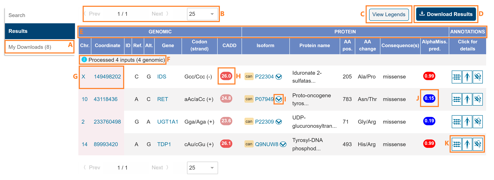
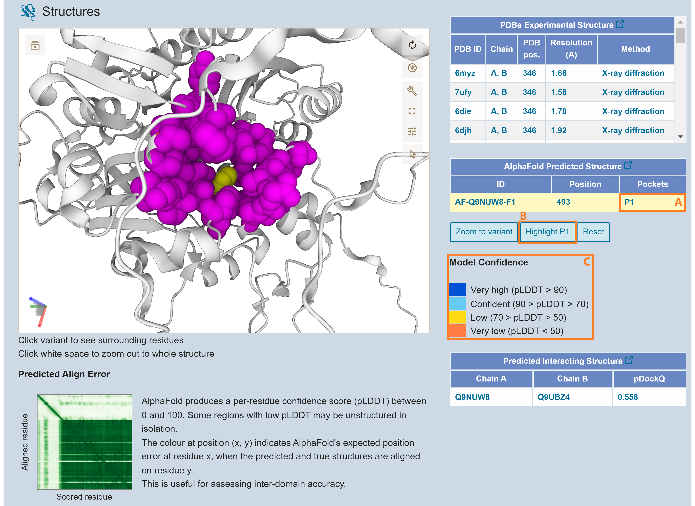

##### Website

Clicking each category in the contents below will take you to an annotated image of the relevant page in ProtVar linked to more detailed descriptions of each feature.

- [Home Page](#home-page)
- [Results Page](#results-page)
- [Functional Information](#function-annotations)
- [Population Observations](#population-observations)
- [Structure Annotations](#structure-annotations)
- [Download Options](#download-options)
- [Downloads](#downloads)

###### Home Page

**A.** ProtVar retrieves annotations and predictions for human [missense](#missense) variants.  
**B.** Users can submit a new search by pressing here and returning to the home screen.
**C.** The [results page](#results-page) page following variant list submission.  
**D.** [Downloads](#downloads) contains all the files you have submitted for download. These can be downloaded from here to your local computer.  
**E.** This can be used to [contact](#contact) ProtVar with questions, comments or suggestions.  
**F.** [ProtVar REST API](#protvar-rest-api) can be used to obtain data programmatically.
**G.** The Help section in ProtVar contains information about the options and fields available in the user interface and a description of the columns in the download.
**H.** About contains information about the ProtVar resource. HELP contains information to help users use the ProtVar resource.  
**I.** Release notes contains statistics about the current ProtVar release.
**J.** Variants can be pasted in the box and then submitted to ProtVar by clicking “Submit”. ProtVar maps genomic coordinates to protein positions and protein positions to genomic coordinates. It can also map from cDNA positions to protein positions and retrieve variants using IDs from dbSNP, COSMIC and ClinVar.
**K.** The paste box can be populated using examples of the different variant formats accepted by ProtVar by clicking these buttons.
**L.** Users can choose which [genome assembly](#genome-assembly) to use for mapping or leave it for ProtVar to decide.  
**M.** [File upload](#file-upload) can be used for uploading large files from your computer.  
**N.** Users should press submit once they have pasted or uploaded their data and chosen the relevant options.

###### Results Page

**A.** [Downloads](#downloads) A. My downloads contains all the files you have submitted for download. These can be downloaded from here to your local computer. Users can return to the same results again by clicking the 'Results' tab. The results will remain during the users session or until they are replaced by new results.   
**B.** Navigate to the previous or next page of results and choose how many results to display on the page.
**C.** The legend shows the colour schemes and category boundaries for scores and predictions. The colours can be switched between ProtVar standardised colours and the original colours.
**D.** Download all variant results. The file will be available in [Downloads](#downloads)  
**E.** The data is split into [genomic position](#genomic-position) and [protein position](#protein-position) and [annotations](#annotations)  
**F.** The types and number of user inputs and processing by ProtVar is shown here.
**G.** The [data type](#data-types) used to submit the variant is shown in pink. Multiple lines may be shown for a single input in cases such as overlapping genes or when the specific SNP is ambiguous.  
**H.** [CADD](#cadd) score is a nucleotide level predictor of pathogenicity.  
**I.** Mappings to different [isoforms](#isoforms) can be observed by expanding.  
**J.** AlphaMissense is an amino acid level predictor of pathogenicity.
**K.** Each of three Annotation types [Function annotation](#function-annotations) and [Population Observations](#population-observations) and [Structure Annotations](#structure-annotations) regarding each variant can be explored by clicking on the icons.

###### Function Annotations

  
**A.** This page contains the [function annotations](#function-annotations) relating to the variant position in the protein.  
**B.** This window contains data regarding the precise variant position in the protein from UniProt and predictions.  
**C.** Curated annotations retrieved from UniProt specifically pertaining to the protein position of the variant.
**D.**  The conservation of the wild-type amino acid from inter species alignments. A score of 0 represents the minimal conservation and a score of 1 is maximal conservation.
**E.** [The predicted free energy change](#predicted-free-energy-change)  in the protein when the reference amino acid is replaced with the variant as calculated using foldX v5.0 on the AlphaFOld structure.
**F.** Predictions relating to the probability that the user entered variant has a pathogenic or benign consequence.
**G.** Information regarding the [region](#region) in which the variant position is located from UniProt.  
**H.** Curated annotations retrieved from UniProt pertaining to the region of the protein surrounding  the variant.
**I.** Predicted [protein pockets](#protein-pockets) containing the variant position containing data on the physicochemical properties and confidence of the pocket prediction.
**J.**  Predicted [protein-protein interfaces](#protein-protein-interfaces) containing the variant position with information about the quality of the interface and the proteins involved.
**K.** A description of the function of the protein from UniProt.  
**L.** This window contains information about the reference protein from UniProt.  
**M.** Protein names and identifiers and UniProt entry information.  
**N.** [General protein information](#general-protein-information) from UniProt.  
**O.** [Ensembl identifiers](#ensembl-identifiers) for the gene and for the transcript which translates to the UniProt canonical isoform.

###### Population Observations

  
**A.** - This page contains data about the variant in other resources and [co-located variants](#co-located-variants)  
**B.** - This window displays identifiers of the user submitted variant in different databases with links to them.  
**C.** - Variants [co-located](#co-located-variants) at the same amino acid as the user variant and associated diseases.  
**D.** - Diseases associated with variation in the protein.

###### Structure Annotations

  
**A.** This page shows the position of the user variant in protein structures.  
**B.** The structure can be animated via this button for example it can spin or rock.  
**C.** The [3D structure viewer](#3d-structure-viewer) uses Mol* to display the structures selected from the tables on the right.  
**D.** Go to the PDBe page for this structure.
**E.** Reset the camera to see the whole protein.  
**F.** Take a screenshot of the current view.  
**G.** Control panel options to change how the structure looks.  
**H.** Expand the view to fill the screen.  
**I.** Change the Mol* settings.  
**J.** Selection mode for residues or regions.  
**K.** All experimental structures which contain the variant position are shown in this table.  
**L.** Press here to zoom and focus the view on the variant position (note: the reference side chain is shown in the structure, not the variant).
**M.** Highlight one chain in multi-chain structures.
**N.** Reset the view to the default.

  
**A.** The latest AlphaFold model for the protein containing the variant with the variant position according to AlphaFold structure numbering.
**B.** Model position confidence. From AlphaFold: “AlphaFold produces a per-residue estimate of its confidence on a scale from 0 - 100. This confidence measure is called pLDDT and corresponds to the model’s predicted score on the lDDT-Cα metric.”
**C.** Predicted align error indicates the confidence in assigning the correct relative positions between regions in the structure and is produced for each structure by AlphaFold.

  
**A.** Predicted pockets are displayed in this table if they contain the variant position. There may be multiple pockets overlapping the variant position in which case each can be selected here.
**B.** Press this button to highlight all of the residues which form the pocket in pink. The variant will also be highlighted but in yellow.
**C.** AlphaFold model confidence is disabled in the structure when investigating pockets but can be retrieved by resetting the view.

  
**A.** Predicted protein-protein interactions are displayed in this table if the variant is considered to be part of the interface.
**B.** pDockQ is a measure of the quality of the interface.
**C.** This highlights the residues in both chains which are involved at the interface.

###### Download Options

  
**A.** - Users can choose to obtain mappings with annotations or mappings only (which is much faster).  
**B.** - Users can choose which specific fields are most useful to them.  
**C.** - Email addresses are optional and are used to notify users when their job is ready.  
**D.** - Job names are optional but can help users to identify specific jobs when multiple jobs have been submitted.  
**E.** - Pressing submit will put the job in a queue. The results will be available from the [Downloads](#downloads) tab.  
**F.** - Close to return to the results page

###### Downloads

  
**A.** - All of the user's downloads for this session will be displayed on this page.  
**B.** - The number of downloads for this session.  
**C.** - A date and time stamp when the download request was received.  
**D.** - ProtVar generated ID.  
**E.** - User supplied job name.  
**F.** - Status - an email will be sent to the user when the requested data is ready to download if they have chosen to supply one. The page will need to be refreshed manually to see the updated status.    
**G.** - Button to download to the user’s local machine.  
**H.** - Delete the file from the list.

#### Website Help Further Information

**3D Structure Viewer:** 3D structures are visualised using the Mol* viewer which “is a modern web-based open-source toolkit for visualisation and analysis of large-scale molecular data”. Further information can be found at their website: [Mol* website](https://molstar.org/)
ProtVar uses a limited version of Mol* with less functionality than the full version to allow proteins to be displayed quickly and smoothly.

**Annotations:** Annotations are subdivided into function annotations, population observations and structure annotations. Annotations either help the user to understand the function of the reference amino acid at the variant position, evaluate the likelihood that the variant amino acid will alter the function or contextualise the variant position and protein role to suggest what effect the variant may have on the organism.

**CADD:** CADD scores “the deleteriousness of single nucleotide variants as well as insertion/deletions variants in the human genome” - from the [CADD website](https://cadd.gs.washington.edu/) CADD scores are freely available for all non-commercial applications however a licence is required for commercial applications, details of which can be found on their website. [CADD citation](https://www.nature.com/articles/ng.2892)

**Co-located Variants:** ProtVar retrieves variants which have been reported at the same amino acid position as the variant. This means that the point mutation itself may be any of the three nucleotide positions of the codon, not necessarily the same genomic position as the user entered variant.

**Contact:** If you have any problems using ProtVar or cannot retrieve the data you want then please use the contact form to get in touch with the ProtVar team who will do their best to assist you. Additionally if you have any suggestions to improve ProtVar or requests to add something new to help your work then please let us know.

**Data Types:** The following variant input data types are currently supported by ProtVar: [VCF](#vcf), [gnomAD](#gnomad), [HGVS](#hgvs), [Protein position](#protein-position), [dbSNP ID](#dbsnp-id).

Examples of each of the formats can be found to the right of the paste input box.
A mixture of formats can be submitted. For example:
>rs864622779  
P22304 A205P  
X 149498202 . C G

ProtVar will evaluate each one and map them to the protein position in a unified format.

**dbSNP ID:** dbSNP is a resource which “contains human single nucleotide variations, microsatellites, and small-scale insertions and deletions." The resource can be found here: [dbSNP website](https://www.ncbi.nlm.nih.gov/snp/) Variants in ProtVar can be searched via the paste box or uploaded using dbSNP RefSNP IDs for example:
> rs4148323

Because dbSNP IDs may represent more than one variant allele, ProtVar will separate the different variant alleles onto different lines on the mapping page. This is because the different variant alleles may have different consequences to the protein

**Download:** Downloads can be tailored according to the users’ needs. If only mappings from genomic coordinates to protein positions are required then “mappings only” can be used. If specific annotations are required then these can be selected individually. Each annotation category selected adds extra time to produce the downloadable file. Files ready for download are displayed in the "Downloads” section. Optionally users can add a job name to keep track of multiple jobs and an email address so that they can be informed when the file is ready to be downloaded. All of the annotations in the download file can also be accessed programmatically via the ProtVar REST API.

**Ensembl identifiers:** The ENSG (Ensembl gene identifiers), ENSP (Ensembl translated sequence identifiers) and ENST (Ensembl transcript identifiers) are given for each isoform. The identifiers in the "Function Annotation" section correspond to those associated with the UniProt canonical isoform. More information about Ensembl stable IDs can be found here: [Ensembl website](http://www.ensembl.org/info/genome/stable_ids/index.html)

**EVE:** EVE is “a model for the prediction of clinical significance of human variants based on sequences of diverse organisms across evolution”. To cite the use of EVE scores: [EVE paper](https://www.nature.com/articles/s41586-021-04043-8)
To explore EVE scores further visit the [EVE website](https://evemodel.org/)

**Function Annotations:** Function annotations are principally sourced from UniProt. There are three sections. The first section contains annotations describing the variant position only. The second section describes the region surrounding the variant as the variant may play a role in a function reliant on the region. The third section describes the role of the protein more generally in order for the user to predict the effect on the organism if the variant affects protein function.

**File Upload:** Any file in plain text format can be uploaded to ProtVar, the delimiter is unimportant and could be a space, tab or comma etc. ProtVar will strip header lines from uploaded files as well as any other data provided additionally to the 4/5 columns required. The output will be in the same variant order as the input file.

**General protein information:** Annotations regarding the variant position itself and the surrounding region may inform users as to the probability that the variation may perturb a protein function. However, more general protein information is required to consider what that effect might have on the organism. This information is all taken from UniProt.

**Genomic position:** Genomic position is defined in terms of the chromosome the variant is found on in the genome and the position within the sequence in terms of a reference assembly. The genomic descriptions in ProtVar results also include the codon which the variant is in with the precise position in upper case as well as the reference and variant nucleotides. Also, in this section is the CADD score of predicted pathogenicity.

**Genome Assembly:** All of the annotations in ProtVar are based upon the mappings between GRCh38 assembly and the UniProt canonical isoform sequence. However, ProtVar does support coordinates in GRCh37 which can be uploaded or pasted to search. ProtVar will map the positions from the GRCh37 to the GRCh38 equivalent positions using pre-mapped equivalency tables derived from the CrossMap tool [CrossMap website](https://crossmap.sourceforge.net/). Users should specify the assembly if they know it. However, ProtVar will by default attempt to predict which assembly the user has submitted by comparing the nucleotides at each user entered coordinate against each reference assembly. This will not work reliably for very small (<10) numbers of variants submitted.

**Genomic Coordinates to Protein Positions:** ProtVar maps genomic coordinates to protein positions by using Ensembl exon boundary coordinates, mapping to relevant positions on transcripts, matching translated transcripts to canonical isoforms and calculating protein positions. By default the canonical isoform is shown as the UniProt annotations use this isoform for numbering.

**gnomAD:** Users may want to copy and paste variants directly from the GnomAD UI to rapidly retrieve annotations, the gnomAD website can be found here: [GnomAD website](http://www.gnomad-sg.org/). The following VCF-like format is therefore supported in ProtVar:
>X-149498202-C-G

**HGVS:** Variants can be submitted to ProtVar using the HGVS nomenclature standard for single nucleotide polymorphisms. This format differs from VCF in that it incorporates the reference sequence the coordinate is based upon, for example:
>NC_000023.11:g.149498202C>G

Futher details about the HGVS format can be found on the [HGVS website](https://varnomen.hgvs.org/bg-material/simple/)

**Isoforms:** ProtVar maps from genomic coordinates to as many different isoforms of the protein as possible. This is limited by the match between the translated transcripts and isoform sequences in UniProt. The isoform displayed by default is the Uniprot canonical isoform which is denoted by a logo “can”. All of the annotations are based upon the numbering in the canonical isoform. Other isoforms, where the variant may be in a different numerical position, are denoted by a logo “iso”.

**Missense:** ProtVar retrieves annotations and predictions for the evaluation of missense mutations. Missense mutations are single nucleotide changes which result in a codon which encodes a different amino acid to the reference sequence. Synonymous mutations are also handled by ProtVar where a point mutation does not alter the encoded amino acid.

**Downloads:** This page contains all the jobs sent for download for this browser session. This means that if you submit several different variant sets you will see a list of jobs here. From this page you can see the status of jobs to check if they are ready. When they are, the files can be downloaded to your local machine.

**Paste:** Several thousand variants can be pasted into the box (for longer lists please upload a file).

**Population Observations:** Descriptions of other humans with the same variation or in the same amino acid location to help users to assess the likely effect of their variant. ProtVar retrieves IDs from several databases which report the same variant as the user query. It also pulls data on co-located variants at the same amino acid position along with accompanying disease notes. ProtVar also retrieves information regarding diseases which have been associated with the protein.

**Predicted Free Energy Change:** This is the difference in Gibbs free energy (stability) of the protein between the wild type state and the protein containing the variant amino acid. It is calculated using the AlphaFold2 structure using FoldX software, details of which can be found on the [FoldX website](https://foldxsuite.crg.eu/)

**Protein-protein Interfaces:** Protein-protein interfaces have been predicted between proteins thought to interact. Both chains are predicted together using the ALphafold2 algorithm. All of the interface data in ProtVar are taken from the following paper which should be cited if this information is used: [Interface paper](https://www.nature.com/articles/s41594-022-00910-8)

**Protein Pockets:** Protein pockets are predicted based on geometry and physico-chemical properties from the regions of high confidence in the AlphaFold2 models.

**Protein Position:** Variant annotations can be accessed in ProtVar via their protein accession and position. The proteins should be named according to the UniProt canonical isoform accession and numbering. ProtVar maps the protein position to the genomic coordinates of the relevant codon on the GRCh38 assembly. ProtVar then considers the codon sequence and the reference and variant amino acids provided by the user to calculate the exact coordinate(s) and the variant nucleotide(s). If there is more than one variant or coordinate which could be possible then both alternatives are shown on different rows in the results.

**Protein Position to Genomic Coordinates:** If the user enters a UniProt accession and position the variant will firstly be mapped to the genomic location on the GRCh38 reference. ProtVar will then retrieve information based on that position. ProtVar uses the codon sequence of the reference and the amino acid variant to calculate which of the positions in the codon must be changed and to which other nucleotide to affect the user entered change. This means that the result is not always a single genomic position or nucleotide change if more than one change can cause the same amino acid variation.

**ProtVar REST API:** The REST API can be used to access single or groups of positions programmatically without needing to use the user interface. This may be useful for embedding in a pipeline or if the user wants to write a parser to extract specific information from the resulting json object.

**Region:** The region has no fixed size but is simply the area surrounding the variant position in sequence space. This may include structural features such as helices or functional features such as binding regions.

**Structure Annotations:** ProtVar retrieves all human experimental structures which contain the protein position of the user defined variant. This is not necessarily all of the structures for that protein. Mol* is used to view the proteins which are retrieved from the PDBe. AlphaFold models are also shown for each protein and predicted pocket regions which contain the variant are displayed on these structures. The third table shows predicted protein-protein interactions where the variant is considered to be part of the interface.

**VCF:** VCF is a tab separated text file format. It contains information about a position in the genome. ProtVar evaluates the first five fields in each line, namely:
>CHROM  - The name of the chromosome on which the variation is being called  
POS - The position of the variation on the sequence  
ID - An identifier of the variation for example dbSNP ID. This is not a mandatory field for ProtVar and can be left out or included as “.”  
REF - The reference base at the given position on the reference sequence. ProtVar always uses the reference of the most recent version of the assembly. If the user base does not match then a warning will appear on the results screen informing the user of the mismatch.  
ALT - The alternative allele at this position. This must be a single nucleotide for ProtVar.

Meta information and header lines are ignored by ProtVar
Further details regarding the VCF format can be found here: [VCF pdf](https://samtools.github.io/hts-specs/VCFv4.2.pdf)

ProtVar is as forgiving as possible with regards to the input format and will attempt to interpret the input if possible. For example the following formats can be read:
>X 149498202 . C/G  
>10 43118436 A C  
>2 233760498 . G A . . .  
>14 89993420 A G
